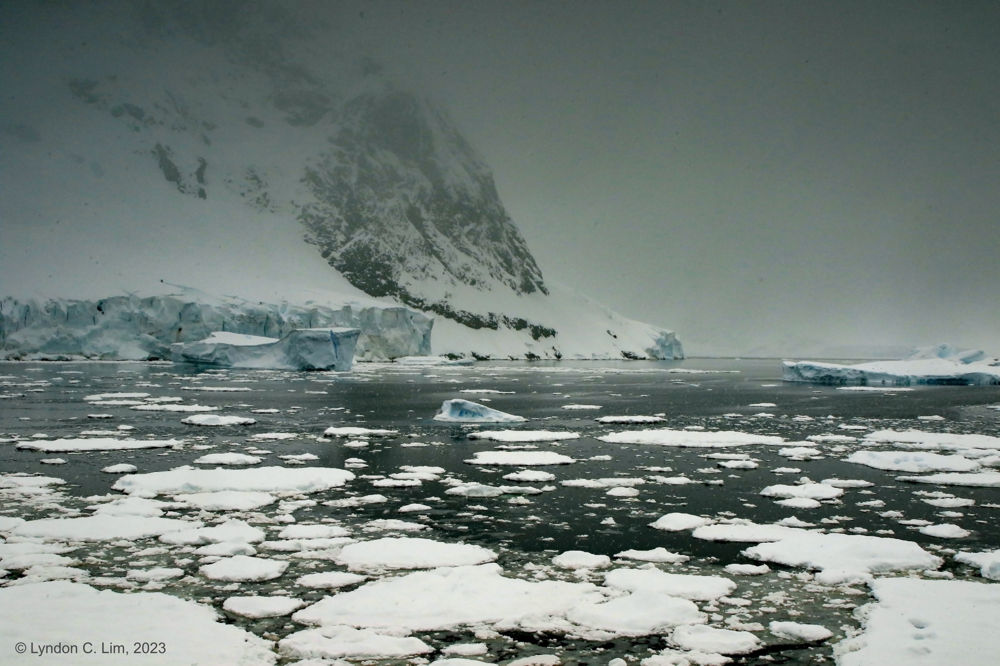

Here are a few of my published research projects, but there are more in the works!


  You can also find my articles on <u><a href="{{author.googlescholar}}">my Google Scholar profile</a>.</u>





  


Sea ice breakup in the Lemaire Channel, Antarctica