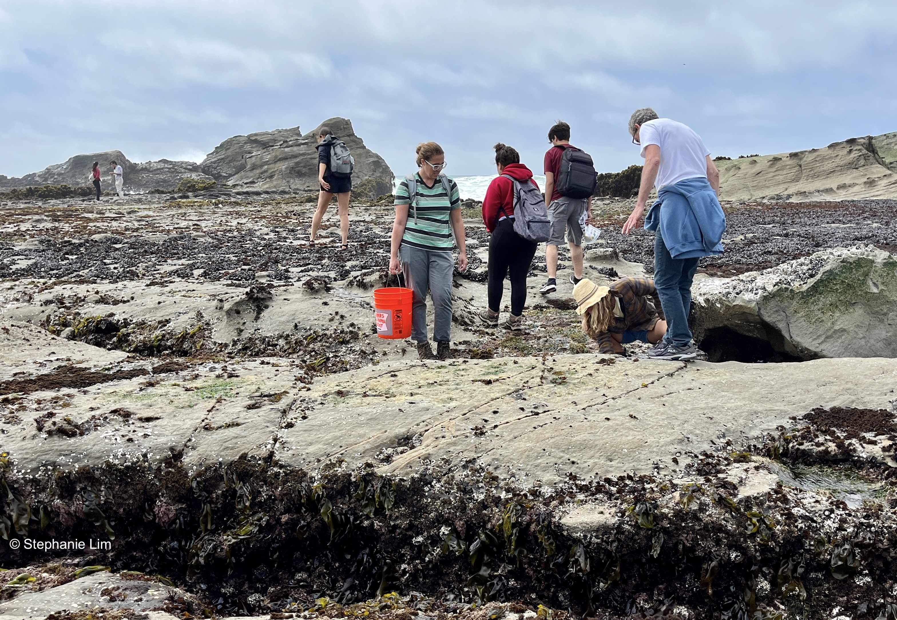

Tidepooling in Half Moon Bay as part of The Oceans class

## Stanford University
### The Oceans: An Introduction to the Marine Environment
* _Co-Instructor of Record_, Spring 2022
* [Syllabus](../files/Syllabus_EARTHSYS8_oceans_2022_May17.pdf)

### Remote Sensing of the Oceans
* _Teaching Assistant_, Winter 2023
* [Class website](http://ocean.stanford.edu/courses/ESS141/)

***
## The Claremont Colleges
### Basic Principles of Chemistry
* _Course Tutor_, Spring 2017, Fall 2017, Spring 2018

### Integrated Biological Chemistry
* _Course Tutor_, Fall 2015, Fall 2016
